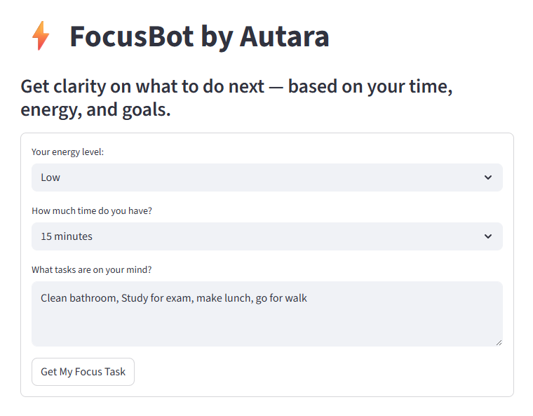

# FocusBot by Autara


FocusBot is a lightweight AI assistant built with Streamlit and OpenAI that helps you decide what to focus on next, based on your available time, energy level, and mental load. It's like having a gentle productivity coach in your pocket.

## Screenshot

Here’s what FocusBot looks like in action:




## Live Demo
[Try FocusBot on Streamlit Cloud](https://autara-focusbot-1.streamlit.app/)  
*(No login required – 5 uses per day for anonymous visitors)*

## Features
- Natural language input for tasks or thoughts
- Adjustable energy and time filters
- Prioritized suggestions using GPT-3.5
- Session-based usage limiter (5 uses/day)
- Friendly encouragement and clarity
- "Powered by OpenAI" + Buy Me a Coffee support link

## 📦 Tech Stack
- Python 3.9+
- [Streamlit](https://streamlit.io)
- [OpenAI Python SDK](https://github.com/openai/openai-python)
- `python-dotenv` (for local development)

## 🚀 How to Run It Locally
1. Clone the repo:
   ```bash
   git clone https://github.com/autara-solutions/autara-focusbot.git
   cd autara-focusbot
   ```
2. Create a virtual environment:
   ```bash
   python -m venv venv
   source venv/bin/activate  # or .\venv\Scripts\activate on Windows
   ```
3. Install requirements:
   ```bash
   pip install -r requirements.txt
   ```
4. Add your OpenAI API key to `.env` (for local use only):
   ```env
   OPENAI_API_KEY=your-api-key-here
   ```
5. Run the app:
   ```bash
   streamlit run app.py
   ```

## Support

If you find FocusBot helpful, consider [buying me a coffee](https://www.buymeacoffee.com/DanDeppert) to support development.

## License

MIT, feel free to fork, improve, and build on it.
